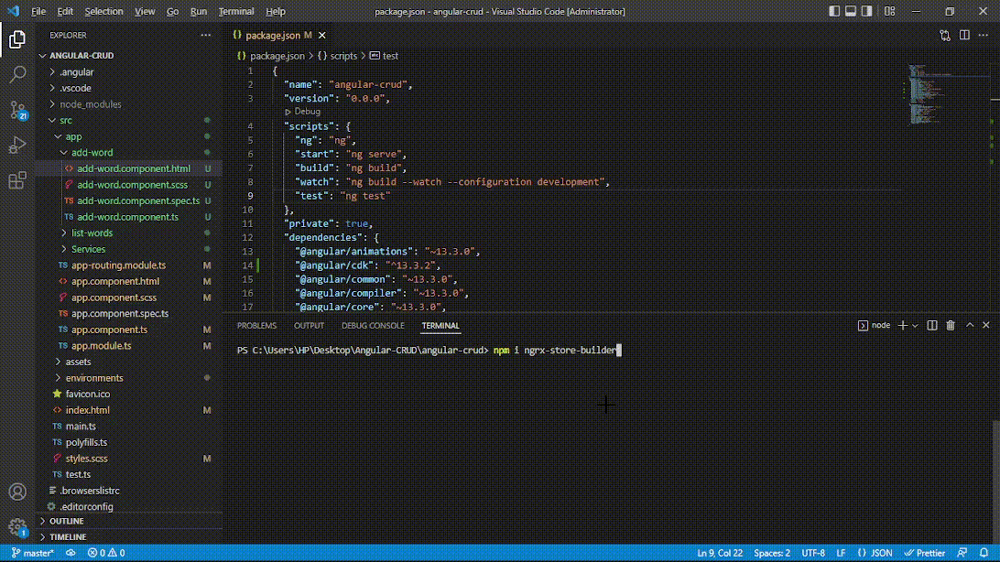

# NgRx Store Builder

When we integrate NgRx in any Angular project, we face the issue of repetitive code for the store files, to resolve the issue we came across the idea of ngrx-store-builder. It aims to generate store files dynamically by providing input of model name and model properties.

#### Note: This package will only work with node version 11 and above and this package is build to be used in Angular projects only.


##  Installation 
Install ngrx-store-builder with npm

### Local Installation
```
npm install ngrx-store-builder --save-dev
```
- Add the following script to the package.json file
```
  "scripts": {
    "generate:store":"generate-store"
  },
```
- Then execute the following command to generate ngrx files
```
npm run generate
```
### Global Installation

```bash
npm install ngrx-store-builder -g
```


- Go to the directory where you want to generate ngrx files
- Run the following command

```
generate-store
```
- You need to provide Model Name and Model Properties as CLI Inputs after you run the above command

## Folder Structure Of NgRx Generated Store
```
store
| 
|___actions //actions folder
|   |   modelName.action.ts
|___effects //effects folder
|   |   modelName.effect.ts
|___models //model folder
|   |   modelName.model.ts
|___reducers //reducer folder
|   |   modelName.reducer.ts
|___services //service folder
|   |   modelName.service.ts
|___states //states folder
|    |   modelName.state.ts
|___selectors //selectors folder
|   |   modelName.selector.ts
```